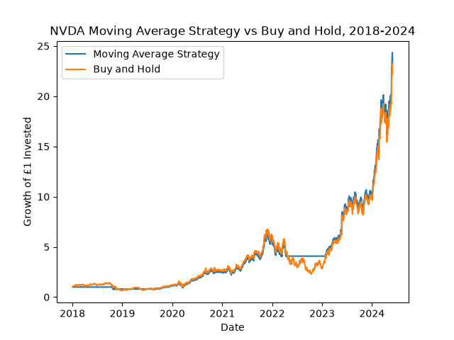

# nvda-ma-crossover-backtest

A Python backtest of a 50-day/200-day moving average crossover strategy on NVIDIA (NVDA) stock, benchmarked against a simple buy-and-hold approach.

## Description

This project simulates a classic trend-following trading strategy — buying when a short-term moving average crosses above a long-term moving average, and selling on the reverse crossover.  The project then evaluates whether it would have outperformed by simply buying and holding the stock over the same period.  
NVIDIA (nvda) data was chosen for this project because it gave an overarching story of "does following the trend help or hurt during a trading cycle", the project functions for the 7-year period of 2018-2024.

## Results 

From this project, I investigated the following metrics: total return, max drawdown and number of trades - this was done for both a moving-average strategy and buy-and-hold strategy.  The results of this project are as follows:

| Metric | Moving-Average Strategy | Buy-and-Hold |
|---|---|---|
| Total Return | 2,223.38% | 2,123.32% |
| Max Drawdown | -37.55% | — |
| Number of Trades | 3 | 1 |

The moving-average strategy modestly outperformed the buy-and-hold strategy, largely by staying in cash during a relatively flat/choppy stretch in 2018–2019 and avoiding part of the 2022 downturn, before capturing the bulk of NVIDIA's 2023–2024 rally.




## Methodology

1. **Data collection:** daily NVDA price history (2018–2024) pulled via `yfinance`.
   
2. **Signal generation:** 50-day and 200-day rolling averages of the closing price.  A `Buy` signal fires when the 50-day average crosses above the 200-day average, and a `Sell` signal fires on the reverse crossover.
   
3. **Position tracking:** a forward-filled `Position` column tracks whether the moving-average strategy is holding NVDA or sitting in cash on any given day.
   
4. **Return calculation:** daily strategy returns are calculated using the *previous* day's position against the *current* day's market return.  Otherwise, you'd be assuming a signal could be acted on the same day it fires, which isn't realistic (look-ahead bias).
   
5. **Cumulative growth:** daily returns are compounded (not summed) using a cumulative product to accurately reflect how gains and losses build on each other over time.
    
6. **Max drawdown:** calculated as the largest peak-to-trough decline in the strategy's cumulative growth curve.


## Dependencies

- Python
- pandas
- yfinance
- matplotlib

## Running The Program

```bash
pip install yfinance pandas matplotlib
python nvda_backtest.py
```

- Did this within command prompt on pc.

## Debugging Issues Met During Project

A couple of non-obvious issues came up while building this that are worth flagging for anyone extending the project:

- After shifting and filling a boolean column, pandas stops treating it as a real boolean, and the `~` operator breaks with a float error (NaN). Had to fix it with `.astype(bool)`.
- Originally forgot to lag the position by a day before multiplying by returns, which gave impossible results (buy signals showing gains on the day they fired, which shouldn't be possible, as described in earlier explanation in Methodology).

  
## Possible Extensions

- Add transaction costs/slippage to the return calculation
- Test the strategy on other tickers or asset classes
- Compare against other moving average windows (e.g. 20/100)
